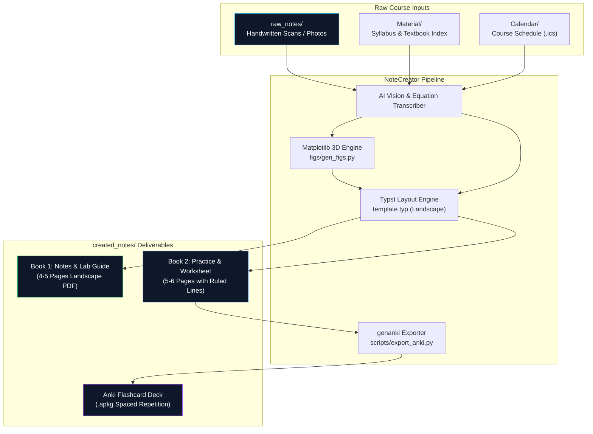

<div align="center">

# 📓 NoteCreator

**Autonomous local-first academic note engine that turns messy handwritten lectures into publication-grade, landscape digital study guides for iPad.**

[](https://typst.app/)
[](https://www.python.org/)
[](https://www.docker.com/)
[](https://apps.ankiweb.net/)
[](https://www.getnoteful.com/)
[](LICENSE)

*Zero fluff. Zero clutter. Dual-book split architecture engineered for Apple Pencil handwriting and active recall.*

</div>

---

## 📋 Table of Contents

- [Why NoteCreator](#-why-notecreator)
- [Key Features](#-key-features)
- [Architecture](#-architecture)
- [Tech Stack](#-tech-stack)
- [Getting Started](#-getting-started)
- [Master AI Agent Prompt](#-master-ai-agent-prompt)
- [iPad & Noteful Workflow](#-ipad--noteful-workflow)
- [Project Structure](#-project-structure)
- [Philosophy](#-philosophy)

---

## 💡 Why NoteCreator

Most AI study tools dump monolithic, text-heavy vertical PDFs that are unreadable on a tablet, cram illegible equation screenshots, or invent practice problems that bear no resemblance to your syllabus. NoteCreator fixes this:

| The Problem with Typical AI Notes | How NoteCreator Fixes It |
|---|---|
| ❌ Giant monolithic PDFs that clutter notes with homework | ✅ **Dual-Book Split Architecture**: Notes & Lab Guide separate from Practice & Worksheets |
| ❌ Vertical portrait layout leaves black bars on iPad screens | ✅ **Native 11" Landscape**: Edge-to-edge widescreen layout formatted for Noteful/Goodnotes |
| ❌ Generic LLM math hallucination with missing steps | ✅ **Rigorous Step Derivation**: Complete algebra, parameter tables, and explicit endpoint verification |
| ❌ Blurry or broken inline drawing | ✅ **Decoupled 3D Diagram Pipeline**: High-res transparent PNGs pre-rendered via Python & Matplotlib |
| ❌ Worksheets get filled once and forgotten | ✅ **Instant Anki Export**: Generates `.apkg` flashcard decks directly from active-recall questions |
| ❌ Blind to your actual professor's expectations | ✅ **Dynamic Context Detection**: Slices your syllabus, textbook edition, and `.ics` calendars on-demand |

---

## ✨ Key Features

<table>
<tr>
<td width="50%" valign="top">

### 📖 Dual-Book Split Architecture
Separates theory from practice. **Book 1 (Notes & Lab Reference)** stays clean for open-book labs and quick concept lookup; **Book 2 (Practice & Homework)** provides full exam walkthroughs, active recall, and answer keys.

### ✍️ iPad Pro 11" Optimized (Noteful Ready)
Crafted specifically for landscape tablet note-taking. Generates full-width ruled `#worklines()` giving your Apple Pencil comfortable physical space to write derivations without zooming.

### 📐 Decoupled 3D Diagram Layer
3D surfaces, space curves, quadrics, and vector fields are plotted in Python with transparent backgrounds and unified color palettes before Typst compiles — zero layout engine crashes.

</td>
<td width="50%" valign="top">

### 🗃️ Automatic Anki Deck Generation
Turns every `#question(n)` and `#answer(n)` block in your practice book into an importable, spaced-repetition Anki deck (`.apkg`) with a single command.

### 🎯 Dynamic Syllabus & Calendar Sync
Drop your course syllabus, textbook name/PDF, and schedule (`.ics`) into `Material/` and `Calendar/`. The engine tailors alert callouts (`#quizalert`, `#assignalert`) to your actual upcoming midterms and labs.

### 🐳 Zero-Install Docker Compiler
Includes a lightweight Docker Compose setup pre-configured with the official Typst binary and font volumes — compile on Windows, Mac, or Linux with no local toolchain setup.

</td>
</tr>
</table>

---

## 🏗️ Architecture



---

## 🧱 Tech Stack

| Component | Technology | Description |
|---|---|---|
| **Document Compiler** | [Typst v0.13+](https://typst.app/) | Next-generation markup language delivering $<50$ ms incremental builds |
| **Container Engine** | [Docker Compose](https://docs.docker.com/compose/) | Isolated, reproducible compilation environment without local CLI dependencies |
| **Visualization Layer** | [Python 3](https://python.org) + [Matplotlib](https://matplotlib.org) + NumPy | Custom 3D wireframes, quadrics, and parametric space curves |
| **Typography System** | Atkinson Hyperlegible + Patrick Hand + Caveat | High-legibility body type, informal hand-drawn headers, and annotation accents |
| **Active Recall Engine** | [genanki](https://github.com/kerrickstaley/genanki) | Programmatic Anki deck generator extracting structured Typst Q&A pairs |
| **Target Surface** | [Noteful](https://www.getnoteful.com/) on iPad Pro 11" | Digital notebook import with Apple Pencil handwriting compatibility |

---

## 🚀 Getting Started

<details open>
<summary><strong>1. Clone the repository</strong></summary>

```bash
git clone https://github.com/ZenzerJs/Note-Creator.git
cd Note-Creator
```
</details>

<details>
<summary><strong>2. Add your lecture material</strong></summary>

- Drop photos of your handwritten notes or scanned PDFs into `raw_notes/`.
- *(Optional for maximum fidelity)*:
  - Place your course syllabus outline in `Material/`.
  - Add your textbook name or chapter problems list in `Material/`.
  - Drop your course calendar export (`.ics`) into `Calendar/`.
</details>

<details>
<summary><strong>3. Compile your digital notebooks</strong></summary>

**Option A: Using Docker (Zero local installs needed)**
```bash
# Compile Book 1 (Notes & Lab Guide):
docker compose run --rm typst compile --font-path fonts lecture01_notes.typ created_notes/MA201_Lecture01_Notes.pdf

# Compile Book 2 (Practice & Homework Worksheet):
docker compose run --rm typst compile --font-path fonts lecture01_practice.typ created_notes/MA201_Lecture01_Practice.pdf

# Export Anki Spaced-Repetition Deck:
python scripts/export_anki.py lecture01_practice.typ created_notes/MA201_Lecture01.apkg
```

**Option B: Using Native Typst CLI**
```powershell
# Windows:
winget install --id Typst.Typst

# Mac:
brew install typst

# Compile directly:
typst compile --font-path fonts lecture01_notes.typ created_notes/MA201_Lecture01_Notes.pdf
typst compile --font-path fonts lecture01_practice.typ created_notes/MA201_Lecture01_Practice.pdf
```
</details>

---

## 🤖 Master AI Agent Prompt

When using an AI agent (Claude Code, Antigravity, or Cursor), copy and paste this prompt to autonomously process new lecture notes:

```markdown
You are an expert academic TA, instructional designer, and Typst note architect.

I have uploaded new raw lecture material into `raw_notes/` (photos of handwriting, slides, or whiteboard captures).

Process this lecture and generate our standard Dual-Book horizontal landscape package according to `template.typ` and `.agents/rules.md`:

### 1. Ingestion & Dynamic Context Analysis
- Read raw handwritten notes directly using vision. Complete any cut-off derivations faithfully without guessing.
- Check `Material/` for any course syllabus, textbook name/edition, or assigned problem lists. Cross-reference textbook section numbers, notation conventions, and homework questions.
- Check `Calendar/` for upcoming quiz/exam deadlines to populate real dates into alert callouts.

### 2. Visualization Layer
- For any 3D surface, space curve, or geometric setup, write standalone Python scripts in `figs/` using `style_3d()` with transparent backgrounds.
- Save diagrams as PNGs in `figs/` and embed them into Typst via `#fig("figs/name.png", caption: [...])` or `#qcard(...)`.

### 3. Book 1: Lecture Notes & Lab Guide (`lectureXX_notes.typ`)
- Format: Horizontal landscape (`doc.with(landscape: true)`).
- Section 1: Recap & Visual Intuition (spatial intuition, geometric definitions, parameter progressions).
- Section 2: Classification Cheat-Sheet (`#matrix()` recognition table + 3-column grid of `#qcard()`).
- Section 3: Assessment Traps & Lab Tips (`#quizalert` for traps, `#assignalert` for deadlines/rubrics, `#mapletip` or software code in `#code("...")`).

### 4. Book 2: Practice & Homework Worksheet (`lectureXX_practice.typ`)
- Section 1: Fully Worked Problems (2-4 step-by-step problems with complete algebra, intermediate steps, and verification).
- Section 2: Master Problem / Deep-Dive Analysis.
- Section 3: Active-Recall Worksheet (2-4 `#question(n)` blocks with wide `#worklines(n)` for Apple Pencil handwriting in Noteful/Goodnotes).
- Section 4: Detached Answer Key (final page with complete `#answer(n)` solutions).

### 5. Build & Output
- Compile both books into `created_notes/`:
  - `created_notes/<Course>_LectureXX_Notes.pdf`
  - `created_notes/<Course>_LectureXX_Practice.pdf`
- Export flashcards: `python scripts/export_anki.py lectureXX_practice.typ created_notes/<Course>_LectureXX.apkg`.
- Export preview PNGs (`figs/notes_page_{p}.png`, `figs/practice_page_{p}.png`) and render an interactive carousel artifact in chat.

Typst Rules:
- Unicode `⟨ ⟩` for vectors (not `angle.l` / `angle.r`).
- Keep `breakable: false` on callout boxes.
- No hard `pagebreak()`; use `pagebreak(weak: true)` or natural flow to eliminate whitespace gaps.
```

---

## 📱 iPad & Noteful Workflow

1. **AirDrop or Cloud Sync**: Transfer the output PDFs from `created_notes/` directly to your iPad (AirDrop, Google Drive, iCloud, or OneDrive).
2. **Import into Noteful**: Tap **+ (Import)** $\to$ select `MA201_LectureXX_Notes.pdf` or `Practice.pdf`.
3. **Dual-Pane Study Mode**:
   - Open **Book 1 (Notes)** on the left half of your iPad screen.
   - Open **Book 2 (Practice)** on the right half.
   - Use Apple Pencil to solve worksheet problems on the faint ruled `#worklines()`.
4. **Anki Import**: Tap `MA201_LectureXX.apkg` on your Mac/iPad to import the cards straight into your Anki study deck.

---

## 📁 Project Structure

```text
├── .agents/
│   ├── rules.md                 # Universal agent instructions, standards & workflow
│   └── mcp_config.json          # MCP tool definitions (typst-mcp)
├── Calendar/                    # Optional course schedule exports (.ics, gitignored)
├── created_notes/               # Final output deliverables (PDFs & Anki .apkg)
│   ├── MA201_Lecture01_Notes.pdf
│   ├── MA201_Lecture01_Practice.pdf
│   └── MA201_Lecture01.apkg
├── figs/                        # 3D diagram assets & matplotlib generators
├── fonts/                       # Atkinson Hyperlegible, Caveat, Patrick Hand TTFs
├── Material/                    # Optional syllabus, textbook, and problem lists (gitignored)
│   ├── PRACTICE_PROBLEMS.md     # Assigned chapter problem reference
│   └── README.md                # Guide for dropping course materials
├── raw_notes/                   # Incoming raw lecture scans / photos (gitignored)
├── scripts/
│   └── export_anki.py           # Auto-generates Anki decks from Typst worksheets
├── docker-compose.yml           # Pre-configured Typst compiler container
├── lecture01_notes.typ          # Lecture 01 Notes Book source
├── lecture01_practice.typ       # Lecture 01 Practice Book source
├── template.typ                 # Reusable landscape layout components & card designs
└── README.md
```

---

## 🧠 Philosophy

- **Local-First & Private**: Your lecture notes, grades, and personal calendar never leak to third-party cloud note silos. Everything compiles locally on your disk.
- **Form Follows Function**: Textbooks are designed for print; digital notes should be designed for the screen they are read on. Horizontal landscape eliminates scrolling fatigue on tablets.
- **Active Recall Over Passive Skimming**: Reading notes gives an illusion of competence; writing out derivations and drilling flashcards builds real exam mastery.

---

<div align="center">
Built with ❤️ for STEM students using Antigravity, Typst, and Noteful.
</div>
