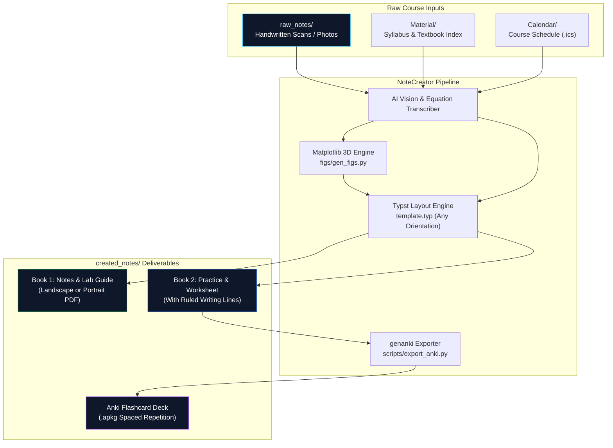

<div align="center">

# 📓 NoteCreator

**Autonomous local-first academic note engine that turns messy handwritten lectures into publication-grade digital study guides for any device, orientation, and note-taking app.**

[](https://typst.app/)
[](https://www.python.org/)
[](https://www.docker.com/)
[](https://typst.app/)
[](https://typst.app/)
[](https://typst.app/)
[](https://apps.ankiweb.net/)
[](LICENSE)

*Zero fluff. Zero clutter. Dual-book split architecture engineered for stylus handwriting in any orientation on any device.*

</div>

---

## 📋 Table of Contents

- [Why NoteCreator](#-why-notecreator)
- [Key Features](#-key-features)
- [Architecture](#-architecture)
- [Tech Stack](#-tech-stack)
- [Getting Started](#-getting-started)
- [Customizing Orientation & Surfaces](#-customizing-orientation--surfaces-landscape-vs-portrait)
- [Master AI Agent Prompt](#-master-ai-agent-prompt)
- [Digital Note-Taking Workflow (Any App)](#-digital-note-taking-workflow-any-app)
- [Project Structure](#-project-structure)
- [Philosophy](#-philosophy)

---

## 💡 Why NoteCreator

Most AI study tools dump monolithic, text-heavy PDFs with awkward aspect ratios, illegible equation screenshots, or practice problems disconnected from your syllabus. NoteCreator fixes this:

| The Problem with Typical AI Notes | How NoteCreator Fixes It |
|---|---|
| ❌ Giant monolithic PDFs that clutter notes with homework | ✅ **Dual-Book Split Architecture**: Notes & Lab Guide separate from Practice & Worksheets |
| ❌ Rigid page formats that leave black letterboxing on screens | ✅ **Any Device & Orientation**: Seamlessly switch between landscape (tablets) or portrait (binders/mobile) |
| ❌ Locked into a single app or ecosystem | ✅ **Universal PDF Standard**: Imports flawlessly into Noteful, Goodnotes, Notability, Samsung Notes, or Acrobat |
| ❌ Generic LLM math hallucination with missing steps | ✅ **Rigorous Step Derivation**: Complete algebra, parameter tables, and explicit endpoint verification |
| ❌ Blurry or broken inline drawing | ✅ **Decoupled 3D Diagram Pipeline**: High-res transparent PNGs pre-rendered via Python & Matplotlib |
| ❌ Worksheets get filled once and forgotten | ✅ **Instant Anki Export**: Generates `.apkg` flashcard decks directly from active-recall questions |
| ❌ Blind to your actual professor's expectations | ✅ **Dynamic Context Detection**: Slices your syllabus, textbook edition, and `.ics` calendars on-demand |

---

## ✨ Key Features

<table>
<tr>
<td width="50%" valign="top">

### 📖 Dual-Book Split Architecture
Separates theory from practice. **Book 1 (Notes & Lab Reference)** stays clean for open-book labs and quick concept lookup; **Book 2 (Practice & Homework)** provides full exam walkthroughs, active recall, and answer keys.

### ✍️ Fully Customizable Surfaces & Orientation
Crafted for any tablet, laptop, or paper binder. Choose horizontal landscape for wide desk tablet viewing or traditional vertical portrait for printing — with full-width ruled `#worklines()` giving your stylus comfortable space to write.

### 📐 Decoupled 3D Diagram Layer
3D surfaces, space curves, quadrics, and vector fields are plotted in Python with transparent backgrounds and unified color palettes before Typst compiles — zero layout engine crashes.

</td>
<td width="50%" valign="top">

### 📱 Universal PDF App Compatibility
Exports clean, high-resolution vector PDFs ready to import into any note-taking app that supports PDF annotation: Noteful, Goodnotes, Notability, Samsung Notes, Nebo, OneNote, Apple Notes, or Acrobat.

### 🗃️ Automatic Anki Deck Generation
Turns every `#question(n)` and `#answer(n)` block in your practice book into an importable, spaced-repetition Anki deck (`.apkg`) with a single command.

### 🎯 Dynamic Syllabus & Calendar Sync
Drop your course syllabus, textbook name/PDF, and schedule (`.ics`) into `Material/` and `Calendar/`. The engine tailors alert callouts (`#quizalert`, `#assignalert`) to your actual upcoming midterms and labs.

</td>
</tr>
</table>

---

## 🏗️ Architecture



---

## 🧱 Tech Stack

| Component | Technology | Description |
|---|---|---|
| **Document Compiler** | [Typst v0.13+](https://typst.app/) | Next-generation markup language delivering $<50$ ms incremental builds |
| **Container Engine** | [Docker Compose](https://docs.docker.com/compose/) | Isolated, reproducible compilation environment without local CLI dependencies |
| **Visualization Layer** | [Python 3](https://python.org) + [Matplotlib](https://matplotlib.org) + NumPy | Custom 3D wireframes, quadrics, and parametric space curves |
| **Typography System** | Atkinson Hyperlegible + Patrick Hand + Caveat | High-legibility body type, informal hand-drawn headers, and annotation accents |
| **Active Recall Engine** | [genanki](https://github.com/kerrickstaley/genanki) | Programmatic Anki deck generator extracting structured Typst Q&A pairs |
| **Target Surface** | Any Tablet, Laptop, or PDF App | Noteful, Goodnotes, Notability, Samsung Notes, Apple Pencil, or Physical Print |

---

## 🚀 Getting Started

<details open>
<summary><strong>1. Clone the repository</strong></summary>

```bash
git clone https://github.com/ZenzerJs/Note-Creator.git
cd Note-Creator
```
</details>

<details>
<summary><strong>2. Add your lecture material</strong></summary>

- Drop photos of your handwritten notes or scanned PDFs into `raw_notes/`.
- *(Optional for maximum fidelity)*:
  - Place your course syllabus outline in `Material/`.
  - Add your textbook name or chapter problems list in `Material/`.
  - Drop your course calendar export (`.ics`) into `Calendar/`.
</details>

<details>
<summary><strong>3. Compile your digital notebooks</strong></summary>

**Option A: Using Docker (Zero local installs needed)**
```bash
# Compile Book 1 (Notes & Lab Guide):
docker compose run --rm typst compile --font-path fonts lecture01_notes.typ created_notes/Lecture01_Notes.pdf

# Compile Book 2 (Practice & Homework Worksheet):
docker compose run --rm typst compile --font-path fonts lecture01_practice.typ created_notes/Lecture01_Practice.pdf

# Export Anki Spaced-Repetition Deck:
python scripts/export_anki.py lecture01_practice.typ created_notes/Lecture01.apkg
```

**Option B: Using Native Typst CLI**
```powershell
# Windows:
winget install --id Typst.Typst

# Mac:
brew install typst

# Compile directly:
typst compile --font-path fonts lecture01_notes.typ created_notes/Lecture01_Notes.pdf
typst compile --font-path fonts lecture01_practice.typ created_notes/Lecture01_Practice.pdf
```
</details>

---

## 📐 Customizing Orientation & Surfaces (Landscape vs. Portrait)

The design system is fully responsive and automatically reflows to any device screen or physical paper size. You control orientation and dimensions directly at the top of your `.typ` document via `doc.with(...)`, or simply tell the AI which orientation you prefer:

### 1. Landscape Mode (Horizontal — Tablets, Laptops & Desk Monitors)
Optimized for horizontal tablet note-taking (iPad, Galaxy Tab, Surface). Fills the widescreen with zero horizontal letterboxing and provides wide ruled `#worklines()` for stylus handwriting:
```typst
#show: doc.with(
  title: "Lecture 01 Notes",
  landscape: true,             // Horizontal 11" x 8.5"
  paper-size: "us-letter"      // Standard US Letter (or "a4")
)
```

### 2. Portrait Mode (Vertical — Physical Binders, Printable Handouts, Mobile)
If you prefer traditional vertical notes or intend to print physical sheets for a binder:
```typst
#show: doc.with(
  title: "Lecture 01 Notes",
  landscape: false,            // Vertical 8.5" x 11"
  paper-size: "us-letter"
)
```

### 3. Custom Tablet & E-Ink Surfaces (Exact Millimeter Matching)
To match any specific device screen (iPad Mini, iPad Pro 12.9", reMarkable 2, Kindle Scribe, Supernote, Boox):
```typst
#show: doc.with(
  title: "Lecture 01 Notes",
  landscape: true,
  paper-size: "a5"             // Preset, or custom mm dimensions
)
```

All cards (`#definition`, `#keytip`, `#quizalert`), multi-column tables (`#matrix()`), and ruled writing lines (`#worklines()`) automatically reflow to the chosen width and orientation.

---

## 🤖 Master AI Agent Prompt

> 💡 **Tip:** A standalone copy-pasteable version of this prompt is also available in [CLAUDE_PROMPT.md](CLAUDE_PROMPT.md).

When using an AI agent (Claude Code, Antigravity, or Cursor), copy and paste this prompt to autonomously process new lecture notes:

```markdown
You are an expert academic TA, instructional designer, and Typst note architect.

I have uploaded new raw lecture material into `raw_notes/` (photos of handwriting, slides, or whiteboard captures).

Process this lecture and generate our standard Dual-Book package according to `template.typ` and `.agents/rules.md`:

### 1. Ingestion & Dynamic Context Analysis
- Read raw handwritten notes directly using vision. Complete any cut-off derivations faithfully without guessing.
- Check `Material/` for any course syllabus, textbook name/edition, or assigned problem lists. Cross-reference textbook section numbers, notation conventions, and homework questions.
- Check `Calendar/` for upcoming quiz/exam deadlines to populate real dates into alert callouts.

### 2. Surface & Orientation Configuration
- Format: Choose landscape (`doc.with(landscape: true)`) for tablet/widescreen viewing, or portrait (`doc.with(landscape: false)`) for printing/mobile, based on user preference.

### 3. Visualization Layer
- For any 3D surface, space curve, or geometric setup, write standalone Python scripts in `figs/` using `style_3d()` with transparent backgrounds.
- Save diagrams as PNGs in `figs/` and embed them into Typst via `#fig("figs/name.png", caption: [...])` or `#qcard(...)`.

### 4. Book 1: Lecture Notes & Lab Guide (`lectureXX_notes.typ`)
- Section 1: Recap & Visual Intuition (spatial intuition, geometric definitions, parameter progressions).
- Section 2: Classification Cheat-Sheet (`#matrix()` recognition table + multi-column grid of `#qcard()`).
- Section 3: Assessment Traps & Lab Tips (`#quizalert` for traps, `#assignalert` for deadlines/rubrics, `#mapletip` or software code in `#code("...")`).

### 5. Book 2: Practice & Homework Worksheet (`lectureXX_practice.typ`)
- Section 1: Fully Worked Problems (2-4 step-by-step problems with complete algebra, intermediate steps, and verification).
- Section 2: Master Problem / Deep-Dive Analysis.
- Section 3: Active-Recall Worksheet (2-4 `#question(n)` blocks with wide `#worklines(n)` for stylus handwriting in any note-taking app).
- Section 4: Detached Answer Key (final page with complete `#answer(n)` solutions).

### 6. Build & Output
- Compile both books into `created_notes/`:
  - `created_notes/<Course>_LectureXX_Notes.pdf`
  - `created_notes/<Course>_LectureXX_Practice.pdf`
- Export flashcards: `python scripts/export_anki.py lectureXX_practice.typ created_notes/<Course>_LectureXX.apkg`.
- Export preview PNGs (`figs/notes_page_{p}.png`, `figs/practice_page_{p}.png`) and render an interactive carousel artifact in chat.

Typst Rules:
- Unicode `⟨ ⟩` for vectors (not `angle.l` / `angle.r`).
- Keep `breakable: false` on callout boxes.
- No hard `pagebreak()`; use `pagebreak(weak: true)` or natural flow to eliminate whitespace gaps.
```

---

## 📱 Digital Note-Taking Workflow (Any App)

1. **Transfer Deliverables**: Transfer the output PDFs from `created_notes/` to your device (AirDrop, Google Drive, iCloud, OneDrive, or local USB).
2. **Import into Any PDF-Compatible App**:
   - **iOS / iPadOS**: Noteful, Goodnotes, Notability, Apple Notes.
   - **Android / Windows**: Samsung Notes, Nebo, OneNote, Xodo, Acrobat.
   - **E-Ink**: reMarkable, Supernote, Kindle Scribe, Boox.
3. **Dual-Pane Study Setup**:
   - Open **Book 1 (Notes)** on one side of your screen.
   - Open **Book 2 (Practice)** on the other side.
   - Write out worksheet solutions directly on the faint ruled `#worklines()` using your stylus or Apple Pencil.
4. **Anki Flashcards**: Double-click or tap `created_notes/<Course>_LectureXX.apkg` to import the active-recall deck straight into Anki.

---

## 📁 Project Structure

```text
├── .agents/
│   ├── rules.md                 # Universal agent instructions, standards & workflow
│   └── mcp_config.json          # MCP tool definitions (typst-mcp)
├── Calendar/                    # Optional course schedule exports (.ics, gitignored)
├── created_notes/               # Final output deliverables (PDFs & Anki .apkg)
│   ├── Lecture01_Notes.pdf
│   ├── Lecture01_Practice.pdf
│   └── Lecture01.apkg
├── figs/                        # 3D diagram assets & matplotlib generators
├── fonts/                       # Atkinson Hyperlegible, Caveat, Patrick Hand TTFs
├── Material/                    # Optional syllabus, textbook, and problem lists (gitignored)
│   ├── PRACTICE_PROBLEMS.md     # Assigned chapter problem reference
│   └── README.md                # Guide for dropping course materials
├── raw_notes/                   # Incoming raw lecture scans / photos (gitignored)
├── scripts/
│   └── export_anki.py           # Auto-generates Anki decks from Typst worksheets
├── docker-compose.yml           # Pre-configured Typst compiler container
├── lecture01_notes.typ          # Lecture 01 Notes Book source
├── lecture01_practice.typ       # Lecture 01 Practice Book source
├── template.typ                 # Reusable layout components & card designs (any surface/orientation)
└── README.md
```

---

## 🧠 Philosophy

- **Local-First & Private**: Your lecture notes, grades, and personal calendar never leak to third-party cloud note silos. Everything compiles locally on your disk.
- **Form Follows Device**: Textbooks are formatted for print; digital notes should fit whatever screen you read them on. Landscape or portrait, edge-to-edge with zero letterboxing.
- **Active Recall Over Passive Skimming**: Reading notes gives an illusion of competence; writing out derivations and drilling flashcards builds real exam mastery.

---

<div align="center">
Built with ❤️ for STEM students using Antigravity and Typst.
</div>
